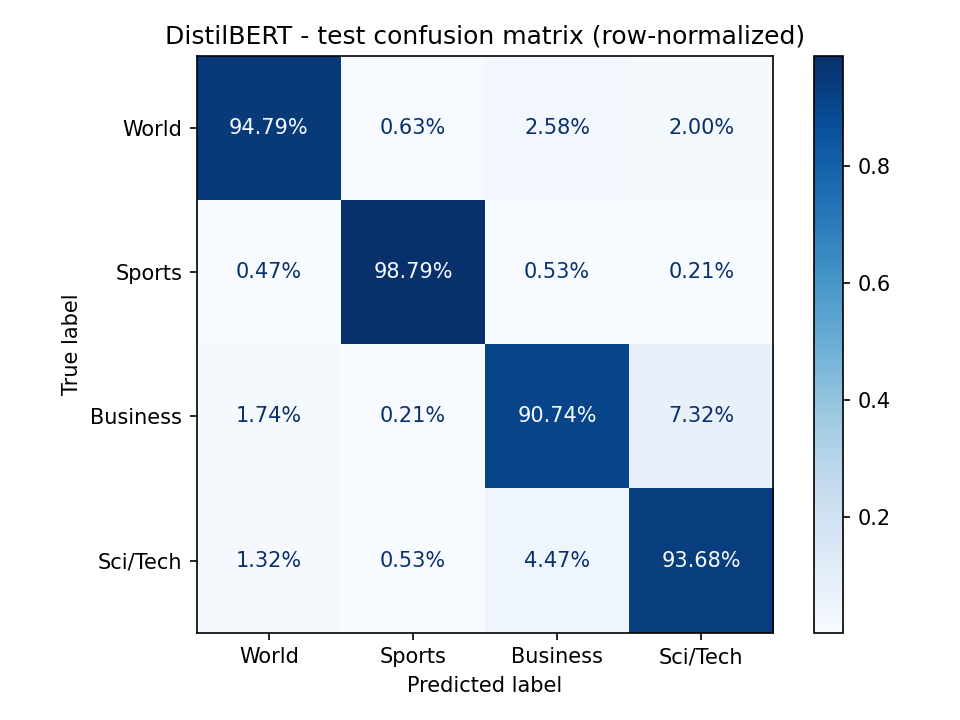
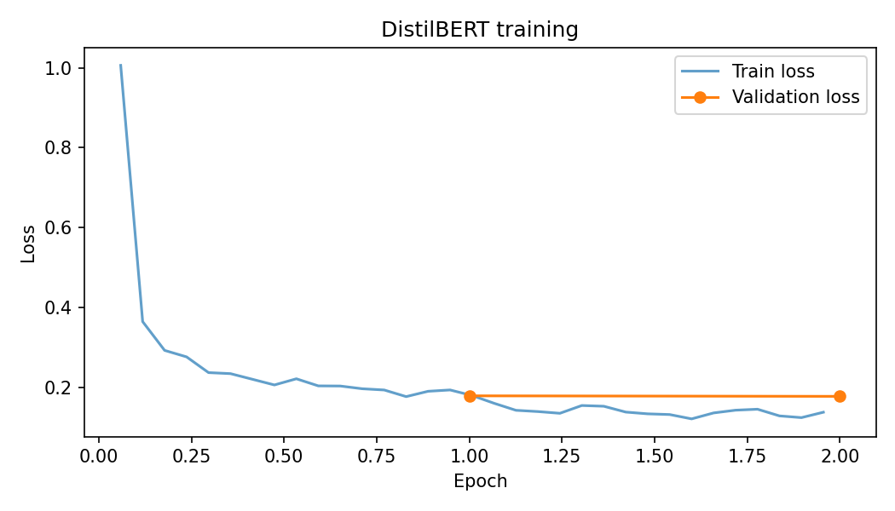
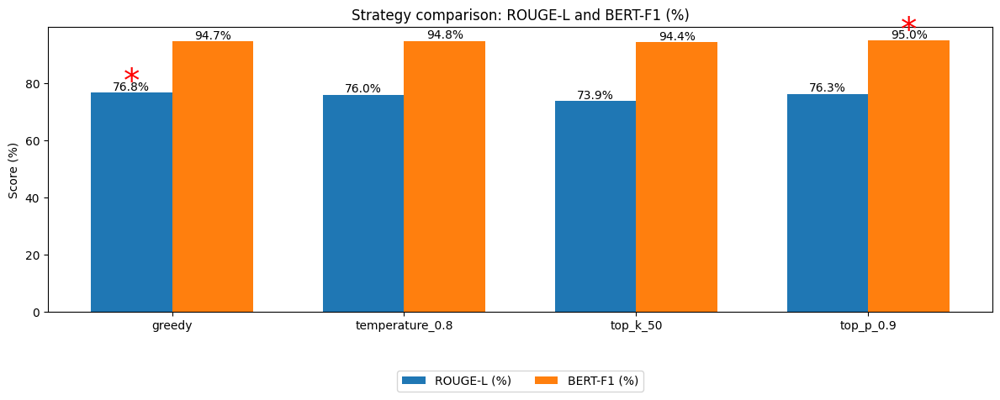
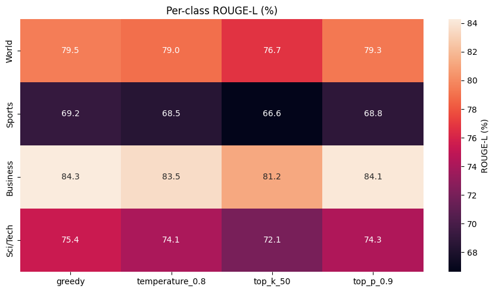
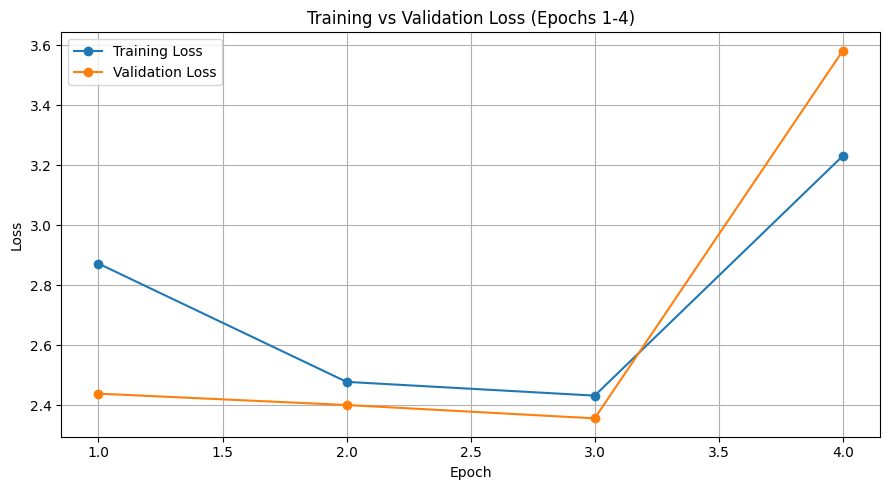

# AG News Topic Classification & Headline Generation

Two NLP tasks on the AG News dataset (120K news articles, 4 topics):
1. **Topic classification:** fine-tuned **DistilBERT** to label articles as World, Sports, Business, or Sci/Tech.
2. **Headline generation:** fine-tuned **T5-base (223M parameters)** to generate headline-style lead sentences, then analyzed how decoding strategy and news category affect output quality.

**TL;DR:** DistilBERT reaches **94.5% accuracy** (94.5% macro F1) on the official 7,600-article test set. T5-base reaches 76.81% ROUGE-L and 94.68% BERTScore-F1 on 2,000 held-out test articles. Greedy decoding gave the best word-level match, top-p sampling the best semantic match, and Business headlines were easiest to generate.

## Topic Classification (DistilBERT)

Fine-tuned `distilbert-base-uncased` on 108,000 articles, selected the best epoch on a 12,000-article validation split, and evaluated once on the official 7,600-article test set. Training took about 10 minutes on a Colab T4 GPU.

| Class | Test F1 |
|---|---|
| World | 95.6% |
| Sports | 98.7% |
| Business | 91.5% |
| Sci/Tech | 92.2% |
| **Overall** | **94.5% accuracy, 94.5% macro F1** |

- **Sports** is easiest (98.8% recall) because of distinctive vocabulary: teams, scores, leagues.
- **Business vs Sci/Tech** is the main source of errors: 7.3% of Business articles are predicted as Sci/Tech, and 4.5% of Sci/Tech as Business. Tech-company earnings and product-market stories genuinely belong to both.
- Validation loss is flat from epoch 1 to 2 while training loss keeps falling, so 2 epochs is enough. More training would start to overfit.





## Headline Generation (T5-base)

### Decoding strategy comparison

| Decoding | ROUGE-L F1 | BERTScore F1 |
|---|---|---|
| **Greedy** | **76.8%** | 94.7% |
| Temperature (0.8) | 76.0% | 94.8% |
| Top-k (50) | 73.9% | 94.4% |
| Top-p (0.9) | 76.3% | **95.0%** |

Greedy decoding matched the reference wording most closely. Sampling adds variety, which lowers word overlap (ROUGE) but can keep or slightly improve meaning (BERTScore), as top-p shows.



### Per-category performance

Business headlines were easiest (84.3% ROUGE-L, 96.4% BERTScore). Sports was hardest, likely because team names, scores, and stats are harder to match word for word.



### T5 training curves



## A note on the target

AG News ships topic labels but no separate headlines. So for each article, the **first sentence is used as the pseudo-headline** and the remaining text is the model input. The first sentence shares many names and key terms with the rest of the article, so ROUGE scores run much higher than on benchmarks with human-written headlines (such as Gigaword). The scores here are best read as a comparison between decoding strategies and categories, not as an absolute measure of headline quality.

## Headline Generation Methodology

1. **Preprocessing:** first sentence becomes the pseudo-headline (target), the remaining text becomes the input. Whitespace normalized, no lowercasing or stemming (transformers are trained on raw text).
2. **Tokenization:** T5 tokenizer, 256-token input and 32-token target, with the `"summarize: "` prefix from T5's text-to-text format.
3. **Fine-tuning:** `t5-base` with Hugging Face `Seq2SeqTrainer` on the full 120K training set, 6 epochs (best configuration from a hyperparameter sweep).
4. **Evaluation:** ROUGE-L and BERTScore-F1 on a 2,000-article subset of the official test set, overall and by news category.
5. **Decoding:** greedy, temperature sampling, top-k, and top-p compared on the same evaluation subset.

## Repo structure

```
notebooks/
  distilbert_topic_classification.ipynb   # topic classification: fine-tuning + test evaluation
  t5_headline_generation.ipynb            # headline generation: fine-tuning + evaluation
docs/
  images/                        # result plots referenced above
```

## Tech stack

Python · PyTorch · Hugging Face Transformers & Datasets · Seq2SeqTrainer · ROUGE / BERTScore (`evaluate`) · pandas · matplotlib / seaborn · NLTK

## Setup

```bash
pip install -r requirements.txt
```

Open either notebook in `notebooks/`. Both load AG News directly from Hugging Face Datasets (`fancyzhx/ag_news`), so no manual download is needed. A GPU runtime is recommended for training.
